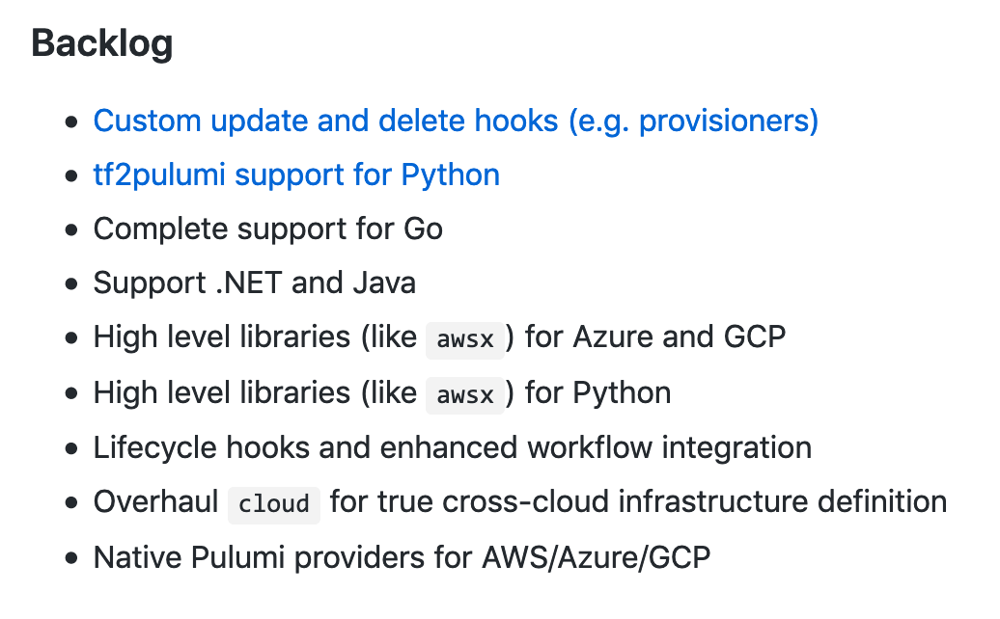
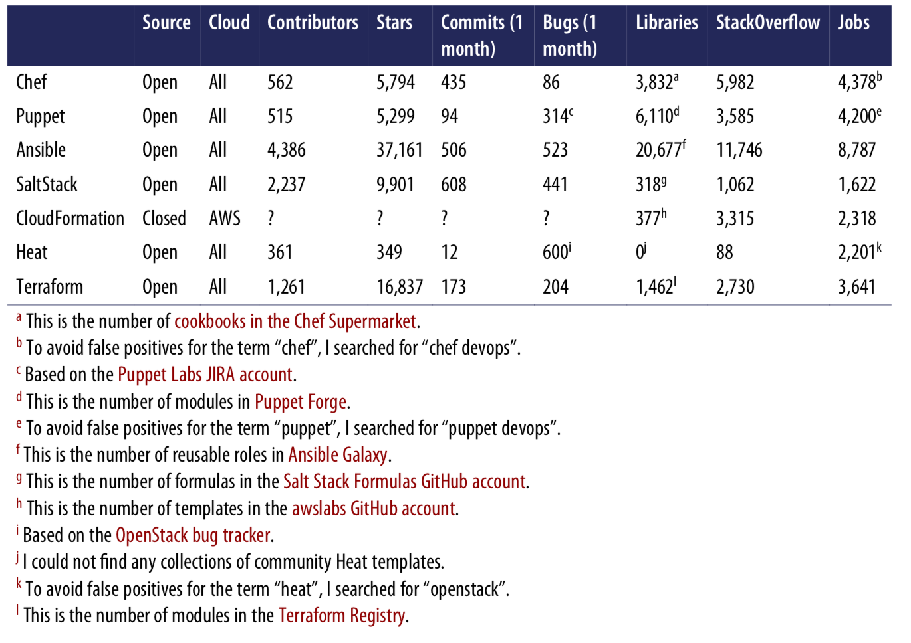

# pulumi-talk
[](https://github.com/jonashackt/pulumi-talk/blob/master/LICENSE)

Notes and links for my talk on Pulumi

Talk is available as PDF: [20191113-Pulumi-vs-Ansible-ContainerConf2019.pdf](20191113-Pulumi-vs-Ansible-ContainerConf2019.pdf)

Example projects used in the talk:

https://github.com/jonashackt/pulumi-python-aws-ansible

https://github.com/jonashackt/pulumi-typescript-aws-fargate


### Talk snippets

##### Create Projects Demo

```
mkdir devopsilmenau && cd devopsilmenau

pulumi new aws-typescript

code .

pulumi up

pulumi destroy

pulumi stack rm
```


##### Configuration Drift Demo (Python)

Open console and enter `pipenv shell`.

Open projects in IntelliJ

Show `__main__.py` first.

```
pipenv install

pulumi destroy --yes

ansible-playbook keypair.yml

pulumi up

ansible-galaxy install -r requirements.yml -p roles/

ansible-playbook playbook.yml

py.test -v tests/test_docker.py --ssh-identity-file=.ec2ssh/pulumi_key --ssh-config=tests/pytest_ssh_config --hosts='ssh://'$(pulumi stack output publicIp)

pulumi destroy --yes
```


##### Fargate ECS Spring Boot Vue.js Demo (Typescript)


Open projects in IntelliJ

Show `index.ts` first.

```
npm install

pulumi destroy --yes

pulumi up

pulumi stack output url
```

Open Browser with `url` output incl. port 8098

```
pulumi destroy --yes
```


#### Why Apples vs. Bananas?

First slide: Why Pulumi vs. Ansible?

Ask stackshare.io!! 

--> https://stackshare.io/pulumi/alternatives


# What is Pulumi?

#### Pulumi? YOUNG! 

1.0 in 09/2019 https://www.heise.de/developer/meldung/Infrastructure-as-Code-Die-Plattform-Pulumi-erreicht-Version-1-0-4516570.html

https://medium.com/@griggheo/good-devops-tech-skills-to-have-in-2019-75d7102eaf28


In contrast to other Infrastructure-as-Code tools, Pulumi uses real programming languages instead of YAML to define infrastructure code:

> At the center of Pulumi is an open-source cloud object model & an evaluation runtime (https://www.pulumi.com/docs/intro/concepts/)

This cloud object model is language agnostic to support multiple programming languages at the same time ([currently Node.js/JavaScript & Python. And there's a Preview for Go and the possibility to implement your own Language](https://www.pulumi.com/docs/intro/languages/)). The evaluation runtime is knows about the cloud resources and how to plan, manage & execute them.

Pulumi Project is a folder with a `Pulumi.yaml` - create with `pulumi new`. 

Pulumi Stacks are like stages (dev, stage, production).


#### Roadmap

Roadmap: https://github.com/pulumi/pulumi/wiki/Roadmap




#### Pulumi service backend architecture

https://www.pulumi.com/docs/intro/concepts/state/


Pulumi self-hosted service-backend is only available in "Pulumi Enterprise": https://www.pulumi.com/pricing/ :(((


#### Pulumi is somehow like a nice Terraform-Wrapper

https://www.pulumi.com/docs/intro/vs/terraform/#using-terraform-providers

Pulumi is able to adapt any Terraform provider - and many of the most interesting Pulumi providers are derived Terraform providers 

--> There's even a Terraform converter: https://www.pulumi.com/docs/intro/vs/terraform/#converting-from-terraform

And Terraform and Pulumi could be used together a the same time: https://www.pulumi.com/blog/using-terraform-remote-state-with-pulumi/


# Comparing Infrastructure-as-Code tools is hard!

!->; Provisioning vs. Configuration Management tools (see https://blog.gruntwork.io/why-we-use-terraform-and-not-chef-puppet-ansible-saltstack-or-cloudformation-7989dad2865c?gi=cfad03e3531b)

__Configure existing servers: Ansible, Chef, Puppet, Saltstack__

__Issues the creation of servers ("provisioning"): Cloudformation, Terraform, Pulumi__

----> BUT: the lines blur! Let's have a look at Ansible's cloud modules: https://docs.ansible.com/ansible/latest/modules/list_of_cloud_modules.html

could do some CM tasks with Terraform, but you can do every single provisioning task with Ansible!


### Provision? Yes! Configure? No!

Imagine your EC2 instance is running, now we want to install some sort of software on it. How do we issue shell commands and the like with Pulumi?

The answer is: NOT AT ALL! There's currently no way to do this (see https://github.com/pulumi/pulumi/issues/99). 

Pulumi website explains why (https://www.pulumi.com/docs/intro/vs/chef_puppet_etc/): 

> Chef, Puppet, Ansible, and Salt are all popular configuration management tools. These tools help you install and manage software on existing cloud infrastructure, either for bootstrapping a virtual machine, or patching one. They do not attempt to solve the problem of provisioning or updating infrastructure, containers, or serverless resources.
  Pulumi is fundamentally different than these tools and works great alongside them. 

Taking Ansible as the current leader of IaC tools, the quote "They do not attempt to solve the problem of provisioning or updating infrastructure" is simply a lie - [Ansible has a whole bunch of Cloud modules available](https://docs.ansible.com/ansible/latest/modules/list_of_cloud_modules.html) and is able to provision or update nearly anything. 

But the last part is interesting "Pulumi is fundamentally different than these tools and works great alongside them." --> so having the need to configure a system, you should use something like Ansible!

Ah interesting... let's have a look into other aspects!


### The central problem in IaC: configuration drift!

See https://blog.gruntwork.io/why-we-use-terraform-and-not-chef-puppet-ansible-saltstack-or-cloudformation-7989dad2865c#b264


> "The academic comparison": Mutable vs. Immutable infrastructure

__Mutable: Ansible, Chef, Puppet, Saltstack__

> For example, if you tell Ansible to install a new version of OpenSSL, it’ll run the software update on your existing servers and the changes will happen in-place. Over time, as you apply more and more updates, each server builds up a unique history of changes. This often leads to a phenomenon known as configuration drift,

--> simply: same servers, changed every time. (focus on configuration management)

__Immutable: Pulumi, Terraform__

> If you’re using a provisioning tool such as Terraform to deploy machine images created by Docker or Packer, then every “change” is actually a deployment of a new server. For example, to deploy a new version of OpenSSL, you would create a new image using Packer or Docker with the new version of OpenSSL already installed, deploy that image across a set of totally new servers, and then undeploy the old servers.

--> simply: new servers, every time. (focus on provisioning)

__Opinion__: Like most academic classification, this doesn't apply in practice!

1. In practice, your Infrastructure code isn't performed manually by yourself from the CLI. Hell NO! We have CI/CD systems doing that for us! And as we are doing Infrastructure-as-CODE, we treat this code like any other code! It'll go through stages - from dev/branches, to master/stage to production.
   --> that means, you only need to look into your CI/CD pipelines (like GitLab CI) to see the state of your servers!
   --> no configuration drift without git commit possible - and if the drift happens, it is intended
2. These tools have a focus on one classification - but you can also do things from the other concept to some extend. Have a look at Terraform's [remote-exec Provisioner](https://www.terraform.io/docs/provisioners/remote-exec.html) for example. The only exception is Pulumi right now, but it's on the roadmap.
   --> No commands on the systems possible right now with Pulumi!!! :((( (see https://github.com/pulumi/pulumi/issues/127 & https://github.com/pulumi/pulumi/issues/99 & https://github.com/pulumi/pulumi/issues/1691)
   --> It's definitely NOT possible to configure a system/server/container whatsoever with Pulumi!!!
3. If you choose Ansible with it's concept of idempotency! Run your commands once or multiple times: the result will be the same!
4. If you choose "shiny immutable infra focuses tool" + "servertemplating", who and what does the term "servertemplating" mean? Doesn't it mean, that you pull up a virtual machine/container and configure stuff or install software on it, then pack the result into an image? Ah well, that's nice! So you're doing immutable infrastructure with configuration management tools?! :))))

That means in most situations you will use multiple tools to get the job done. But this also leads to the problem, that your team has to learn and support multiple IaC tools. I'am personally a fan of reducing the tools you need to learn and master by choosing a framework, that is able to do most of the stuff needed throughout infrastructure development.


> So the state of the machine deviates, or drifts, from the baseline due to manual changes and updates. (see https://shadow-soft.com/ansible-idempotency-configuration-drift/)

##### 2 approaches to address configuration drift

1. Rebuild machine instances frequently so they don’t have much time to drift from the baseline.

2. Use Ansible (& Co.) and run them frequently and repeatedly to keep machines in line

--> See?! It's all about the __frequently__ part! You could also say: continuous! That leads us to modern ways on how to work with Infrastructure code: Continuous infrastructure!


### What is the current state of my infrastructure?

again see see https://blog.gruntwork.io/why-we-use-terraform-and-not-chef-puppet-ansible-saltstack-or-cloudformation-7989dad2865c?gi=cfad03e3531b

> Procedural vs. Declarative

__Procedural: Chef, Ansible__

>  they encourage a procedural style where you write code that specifies, step-by-step, how to to achieve some desired end state.

--> simple: step-by-step "as your code would be the admin" (and as every tutorial states)


__Declarative: Terraform, Pulumi, CloudFormation, SaltStack, Puppet__

> encourage a more declarative style where you write code that specifies your desired end state, and the IAC tool itself is responsible for figuring out how to achieve that state.

--> simple: say what you want, not how. 


Again like Mutalbe vs. Immutalbe: What is the core problem, that should be solved?

###### To answer: "What is the current state of my infrastructure?" we have 2 approaches:

1. Use a declarative approach and have a look into your code.

2. Simply have a look into your CI/CD pipeline to see what has happened last. 

--> In theory, the declaritive approach might "win" the battle. I seems more clean and accurate then these "procedural tools down there in the dust". 
But in practice there are some good reasons why procedural approach is maybe better. 

1. It's absolutely easy to understand! Every Sysadmin knows after minutes of intro: "Ah, this thing automates manual tasks for me! Great!" Try this with Terraform: "What tell hell is this tool doing behind the scenes?"
2. Every tutorial on the web could be easily transformed into procedural code - it's that simple! The declarative tool user simply has a problem, if the needed tool has no provider/module whatsoever for the given task. Or they simply use a procedural tool then ;P
3. less magic - more understanding, what the tool does
4. The downside of a procedural tool, that you don't exactly see the current state of your infrastructure solely in the code, could be wiped out with the use of modern CI/CD tools and GitOps workflows (that you should use in exactly the same way with declarative tools)


### Nobody needs Masters!

Another comparable feature of IaC tools is if they need a master server for storing state of your infrastructure or not:

__Need a Master server: Chef, Puppet, SaltStack, Pulumi__

(Note: most tools support Masterless modes, but then they rely on Agents with their own downsides)

pros: 
* central place to see status of your infrastructure
* continuously enforce configuration in the background

cons: 
* extra infrastructure!
* needs to be maintained
* security: client-to-master and master-to-servers communication needs extra ports to be opened & extra authentication


__Masterless: Ansible, Terraform, CloudFormation__


--> again the pros of a master server without the cons of this extra peace of infrastructure can be introduced in pratice by simply using a CI/CD server! No master needed!


### Nodoby wants Agents either!

__Need Agent on the managed servers to be installed up front: Chef, Puppet, SaltStack__

(Note: there are Agentless modes in these tools, but they don't support the full featureset)

cons: 
* bootstrapping: how to provision servers & install needed agent, if they have no agent installed?
* maintainance of agent: update agent periodically, monitor it
* security: same as with Master server


__No Agent needed (client-only): Ansible, Terraform, Pulumi__

pros: no extra problems with bootstrapping, maintainance, security - no extra moving parts!


### Is YAML really bad? Or how to transform an organisation with classic Sysadmins

> I know some of the guys here do not like YAML. However, it has its place. Not everyone is completely dev minded. YAML in my opinion is a nice middle ground for more ops guys that are gaining more Dev mentality.
 !!! -> Puppet had the problem with code also (abstraction, classes and so on...)
 (reddit: https://www.reddit.com/r/devops/comments/bcdwsn/pulumi/)

There are maybe not only god-like code cracks out there! Imaginge the classic Sysadmin -> maybe you could easily "infect" somebody like this to use a simple YAML-based approach, that could be written with simple editors. Coming around the corner with a full blown language could maybe overwhelm people?!


### The theoretic argument of speed

Google `pulumi ec2 module python` vs `ansible ec2 module` 

> This content is derived from terraform...

ok: google `pulumi ec2 module`

> The documentation is pretty incomplete

> What would help is better docs - last I checked the docs were not good at all and in a lot of typescript and nodejs. I feel more people who would be doing this would be more comfortable with python and the docs for python were weak. For something like this you need great docs.
  I know there is a guy in a thread who is tired of ansible but man are the docs pretty good. You can literally google 'ansible <thing> module' and the page comes up. I'll look at it again when the docs are better.
 (reddit: https://www.reddit.com/r/devops/comments/bcdwsn/pulumi/)


#### JavaScript! --> Use "every" program language you like is currently simple marketing joke

If you have a look at the docs, you'll soon notice, that the Pulumi JavaScript/Typescript docs are great - but choosing Python already is quite disillusioning. And isn't simply there! And no other language as well.

Simply have a look into the example projects: https://github.com/pulumi/examples and focus on the `language` column

And one question: Is it really a good idea to have a full blown programming language available? Do you remember the Design Patterns guys? I once had to integrate a framework, a mathematician build who bought a design pattern book before O_O

__Meme: Mathematician__


### Second broken promise: "Multi-Cloud"

See the examples again: https://github.com/pulumi/examples I see AWS, AWS, AWS... an only single Azure, Kubernetes, GCP


### Large Community vs Small Community



> Ansible leads the pack in terms of popularity


### Test-driven Development with Pulumi

https://www.pulumi.com/blog/testing-your-infrastructure-as-code-with-pulumi/

https://www.pulumi.com/blog/tag/testing/ --> 1 article! :(

https://www.pulumi.com/blog/unit-testing-infrastructure-in-nodejs-and-mocha/

Discussion to test harnesses ended in this https://github.com/pulumi/pulumi/issues/1902

There's a 1 star plugin for [Chef's TDD harness tool kitchenCI](https://kitchen.ci/): https://github.com/jacoblearned/kitchen-pulumi


